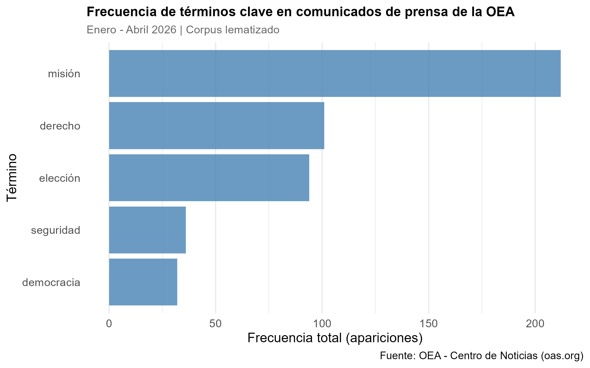

## Introducción

Este informe presenta el análisis de los comunicados de prensa publicados por la Organización de los Estados Americanos (OEA) durante los primeros cuatro meses de 2026 (enero–abril). La OEA es el principal foro político multilateral del hemisferio americano, y sus comunicados de prensa constituyen una fuente valiosa para comprender las prioridades institucionales y los temas que dominan la agenda regional.

La pregunta que guía el análisis es: **¿cuáles son los términos más frecuentes en los comunicados de prensa de la OEA durante el primer cuatrimestre de 2026, y qué revelan sobre las prioridades institucionales de la organización?**

## Estructura del proyecto

El proyecto está organizado de forma modular en tres scripts y un notebook:

- `scripts/scraping_oea.R`: realiza el web scraping de los comunicados de prensa del sitio oficial de la OEA, guarda los archivos HTML descargados y produce una tabla con las variables `id`, `titulo` y `cuerpo`.
- `scripts/processing.R`: limpia el texto de cada comunicado, aplica lematización con el modelo de español de `udpipe`, filtra únicamente sustantivos, verbos y adjetivos, y remueve stopwords.
- `scripts/metrics_figures.R`: construye la Matriz de Frecuencia de Términos (DTM), calcula la frecuencia total de cinco términos seleccionados y genera el gráfico de barras final.

Todos los scripts utilizan rutas relativas mediante el paquete `here`, garantizando la reproducibilidad del proyecto independientemente del sistema operativo o la ubicación del repositorio.

## Metodología

El corpus está compuesto por 67 comunicados de prensa publicados entre enero y abril de 2026. El proceso de análisis siguió los siguientes pasos:

**Web scraping:** se utilizó el paquete `rvest` para descargar los comunicados desde el sitio oficial de la OEA. Antes de scrapear se verificó el archivo `robots.txt` del sitio, que indica un `Crawl-delay` de 3 segundos, respetado mediante `Sys.sleep(3)` entre cada request.

**Limpieza de texto:** se eliminaron signos de puntuación, números, URLs y caracteres especiales mediante expresiones regulares con `stringr`. Todo el texto fue convertido a minúscula.

**Lematización y filtrado gramatical:** se utilizó el paquete `udpipe` con el modelo de español para lematizar cada token y asignarle su categoría gramatical. Se conservaron únicamente sustantivos (`NOUN`), verbos (`VERB`) y adjetivos (`ADJ`), por concentrar mayor carga semántica.

**Remoción de stopwords:** se eliminaron las palabras funcionales del español utilizando el paquete `stopwords` con la fuente Snowball.

**DTM y frecuencias:** se construyó la Matriz de Frecuencia de Términos con `cast_dtm()` del paquete `tidytext`. A partir de esta matriz se calculó la frecuencia total de cinco términos seleccionados por su relevancia institucional.

## Selección de términos

Los cinco términos seleccionados para el análisis son:

- **misión**: refleja el despliegue de misiones electorales y misiones especiales, que constituyen el instrumento de acción más visible de la OEA en 2026.
- **derecho**: presente en referencias a derechos humanos, derecho internacional y Estado de derecho, pilares normativos de la organización.
- **elección**: en 2026 se realizaron varios procesos electorales en la región, en los que la OEA desplegó misiones de observación.
- **seguridad**: vinculado a la seguridad hemisférica, multidimensional y pública, uno de los ejes institucionales de la OEA.
- **democracia**: misión central explícita de la OEA según su Carta constitutiva.

## Resultados

```{r}
#| echo: true
library(here)

# Ejecutar cada etapa en orden
source(here("TP2/scripts/scraping_oea.R"))
source(here("TP2/scripts/processing.R"))
source(here("TP2/scripts/metrics_figures.R"))
```



## Interpretación

El gráfico muestra que **misión** es el término más frecuente con amplia diferencia (212 apariciones), seguido por **derecho** (101) y **elección** (94). Esto refleja que durante el primer cuatrimestre de 2026 la actividad de la OEA estuvo dominada por el despliegue de misiones electorales en la región, en particular en Guatemala y Bolivia.

Los términos **seguridad** (36) y **democracia** (32) aparecen con menor frecuencia absoluta, pero su presencia es consistente a lo largo de todo el corpus. Esto sugiere que, si bien no dominan el volumen de comunicados, constituyen un marco conceptual transversal que sostiene la narrativa institucional de la organización.

En conjunto, los resultados son coherentes con el mandato de la OEA: una organización cuya actividad operativa en este período estuvo centrada en el acompañamiento de procesos electorales, enmarcada en los valores de democracia, derecho y seguridad hemisférica.